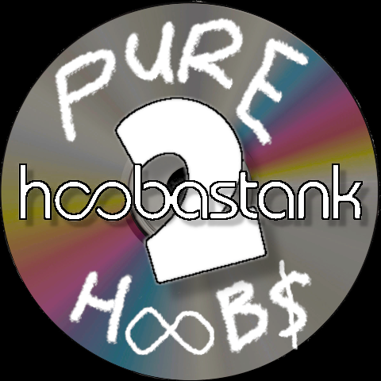

## Pure Hoobs

Many Hoobastans (aka biohackers) have leveled up their souls and/or spirits _multiple_ times in the last month. How? Some seekers suggest that **Pure Hoobs** holds the key.

Stored on a tape drive under the ARPANET mainframe at Area 51, **Pure Hoobs** is purported to be a message from extraterrestrials currently residing in the [Crab Nebula](https://www.youtube.com/watch?v=lyB0oqccNqo&ab_channel=ChandraX-rayObservatory). The government doesn't want you to know about this.

Last weekend, I met with a few other crabHeads on a secure video feed, safe from the prying eyes of the FBI.

After much debate, we have a theory.

### Fifth Dimensionality

As we all know, extraterrestrials ("extras") conduct their activities in higher dimensions. Where are all these extra(!) dimensions? Maybe they're all around us, just really small. Like String Theory. Or maybe there's me, here and now, and I'm entangled with me in another universe where I had lasagna for dinner last night instead of Frito pie. Or maybe the [Pribram-Bohm Hypothesis](https://www.youtube.com/watch?v=vp1JBUc8LbM&ab_channel=WarnerJDuch%C3%A9nM.) is real and everything we observe is the ultra-fast blink between the explicate and implicate realms and the cavity at the middle of our brains is a lens through which an observing universe brings "reality" into focus. Nobody knows.

But it follows that if there are beings operating in the fifth, sixth, or _10th_ dimensions, it would make sense for them to move things around temporarily in the fourth dimension, the same way I move something out of the way on my desk to move something else into that space. Like, what if the story of the universe is just "Tenth-dimensional being moves Post-It note, causing millions of supermassive black holes to collide in the third and fourth dimensions"?

### Conclusion

As such, we have come to the unavoidable conclusion that Crab Nebula aliens are speaking to humans through the playlist of public domain songs used by **_[Hoobastank 2](https://www.twitch.tv/hoobastank2)_** on Twitch. Our testing reveals that mere _exposure_ to the tunes results in elevated levels of Higgs-Boson, the God molecule, in the bodies of study participants.

## Playlist

Our agents/self-proclaimed egyptologists continue to search for the missing codex, the cache of alien data that will reveal the complete message embedded in **Pure Hoobs**. Until its discovery, we can only share the pieces of the puzzle we have found. And welcome new crabbies to our cause.

- "**[Cockpit](https://www.youtube.com/watch?v=a2Ifgt4LG_4&ab_channel=AudioLibrary%E2%80%94Musicforcontentcreators)" and "[Free Dog](https://www.youtube.com/watch?v=T0jE_VnU0b0&ab_channel=AudioLibrary%E2%80%94Musicforcontentcreators)**" by [Silent Partner](https://www.youtube.com/watch?v=siCmqvfw_1g&list=PLzCxunOM5WFKdhkL2L__Kjafqa-qzQGeY&ab_channel=AudioLibrary%E2%80%94Musicforcontentcreators), courtesy of [YouTube Audio Library](https://www.youtube.com/channel/UCht8qITGkBvXKsR1Byln-wA).
- "**[Finland](https://www.youtube.com/watch?v=yhpHaY7Fi5k&ab_channel=NoCopyrightMusic)**" by TrackTribe, courtesy of [YouTube Audio Library](https://www.youtube.com/channel/UCht8qITGkBvXKsR1Byln-wA).
- "**[Grassy Hill](https://www.youtube.com/watch?v=BKWmnTj8D0M&ab_channel=AudioLibrary%E2%80%94Musicforcontentcreators)**" by Huma-Huma, courtesy of [YouTube Audio Library](https://www.youtube.com/channel/UCht8qITGkBvXKsR1Byln-wA).
- "**[White Lotus](https://www.youtube.com/watch?v=DUkqchhiZyA&ab_channel=HarrisHeller-Topic)**," "**[Fever](https://www.youtube.com/watch?v=j6YAx4BWohY&ab_channel=HarrisHeller-Topic)**," "**[Rays](https://www.youtube.com/watch?v=j6YAx4BWohY&ab_channel=HarrisHeller-Topic)**," and "**[It's Her](https://www.youtube.com/watch?v=JYsrrnoRzpY&ab_channel=HarrisHeller-Topic)**" by Harris Heller for [StreamBeats](https://www.streambeats.com/).
- _**[Brume](https://freemusicarchive.org/music/Kai_Engel/Brume)**_ by Kai Engel, courtesy of [Free Music Archive]().
- "**[Game Show Style Music (Knockout)](https://www.youtube.com/watch?v=oFwKWMTMqGA&ab_channel=madmomentsgo)**," "**[Game Show Style Music (Play to Win)](https://www.youtube.com/watch?v=5XXINoidFF8&ab_channel=madmomentsgo)**," "**[TV Game Show Style Music (The Risk)](https://www.youtube.com/watch?v=xKkl6xcUTBE&ab_channel=madmomentsgo)**," and "**[TV Gameshow Style Music (Word Challenge)](https://www.youtube.com/watch?v=u4XMHtbuWhI&ab_channel=madmomentsgo)**" by [madmomentsgo](https://www.youtube.com/channel/UC6PoCPlKjW-pkZeGSOXycGg).
- "**[Fun Activity Montage](https://www.youtube.com/watch?v=1FNkqLuIbr4&ab_channel=MusicLover%E2%80%93NoCopyrightMusic)**" by Biz Baz Studio, courtesy of [YouTube Audio Library](https://www.youtube.com/channel/UCht8qITGkBvXKsR1Byln-wA).
- "**[Fwends](https://www.youtube.com/watch?v=iFxsnYtFtNE&ab_channel=NoCopyrightAudioLibrary)**" by Reed Mathis, courtesy of [YouTube Audio Library](https://www.youtube.com/channel/UCht8qITGkBvXKsR1Byln-wA).
- "**[School Bus Shuffle](https://www.youtube.com/watch?v=RYxHrlbrmCE&ab_channel=LIMORecordingStudio)**" by Freedom Trail Studio, courtesy of [YouTube Audio Library](https://www.youtube.com/channel/UCht8qITGkBvXKsR1Byln-wA).
- "**[Pluck It Up](https://www.youtube.com/watch?v=q1gQh_gJUHY&ab_channel=NoCopyrightMusic)**" by Dan Henig, courtesy of [YouTube Audio Library](https://www.youtube.com/channel/UCht8qITGkBvXKsR1Byln-wA).
- "**[(No Copyright) Cinematic Documentary Background Music For YouTube Videos](https://www.youtube.com/watch?v=EcAX2cbsdRw&ab_channel=AShamaluevMusic)**" by AShamaluevMusic.
- "**[On Foot](https://www.youtube.com/watch?v=_vgl7FJGzrI&ab_channel=NoCopyrightAudioLibrary)**" and "**[Medieval Astrology](https://www.youtube.com/watch?v=bH5NlwQyLpA&ab_channel=NoCopyrightAudioLibrary)**" by Underbelly & Ty Mayer, courtesy of [YouTube Audio Library](https://www.youtube.com/channel/UCht8qITGkBvXKsR1Byln-wA).
- "**[Traces](https://prosearch.tribeofnoise.com/artists/show/35568)**" by EstherGarcia.
- "**[Mont Blanc](https://freemusicarchive.org/music/Podington_Bear/Homage_Fromage/Mont_Blanc)**" by Podington Bear, courtesy of the [Free Music Archive](https://freemusicarchive.org/).
- "**[No Copyright Background Music - Blockbuster Trailer for trailer movies](https://www.youtube.com/watch?v=iYYmLVorpNM&t=29s&ab_channel=VideoSound)**" by VideoSound.
- "**[The Quantum Realm](https://www.youtube.com/watch?v=mROnX3Xqrq8&ab_channel=NoCopyrightAudioLibrary)**" by The Whole Other, courtesy of [YouTube Audio Library](https://www.youtube.com/channel/UCht8qITGkBvXKsR1Byln-wA).

